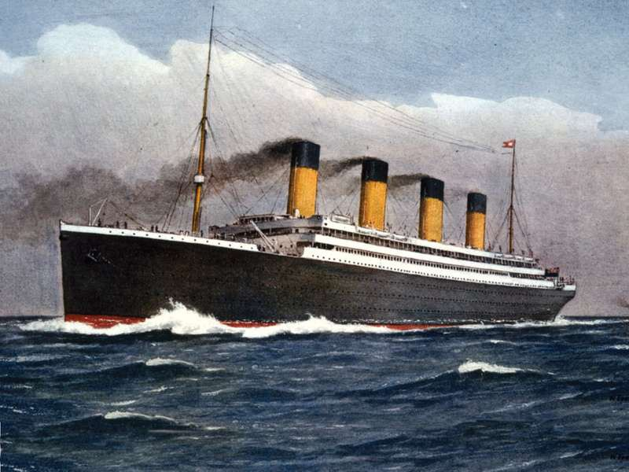

# ⚓ Titanic Passengers Classification - Machine Learning

## The Challenge

The sinking of the Titanic is one of the most infamous shipwrecks in history.

On April 15, 1912, during her maiden voyage, the widely considered “unsinkable” RMS Titanic sank after colliding with an iceberg. Unfortunately, there weren’t enough lifeboats for everyone onboard, resulting in the death of 1502 out of 2224 passengers and crew.

While there was some element of luck involved in surviving, it seems some groups of people were more likely to survive than others.

# 🎯 Goal

The competition is simple: use machine learning to create a model that predicts which passengers survived the Titanic shipwreck.

# 💡 About the data

• Pclass : Ticket class (1st = Upper, 2nd = Middle and 3rd = Lower)

• Sex: Gender (Male and Female)

• Age: Age is fractional if less than 1. If the age is estimated, is it in the form of xx.5

• SibSp: Number of siblings / spouses aboard the Titanic.

• Parch: Number of parents / children aboard the Titanic.

• Ticket: Ticket number.

• Fare: Passenger fare.

• Cabin: Cabin number.

• Embarked: Port of Embarkation (C = Cherbourg, Q = Queenstown, S = Southampton)

# 🌿 Gradient Boosting Trees Model and its Architecture

The model was developed and trained using Sklearn, Feature_Engine and Imblearn. Gradient Boosting Trees has been the algorithm which has performed best in this classification problem. Gradient boosting works by building simpler (weak) prediction models sequentially where each model tries to predict the error left over by the previous model.

## Best results : 77.272 % accuracy

# 🚀 Future Work

• Feature Engineering with Cabin Variables

• Feature Engineering with SibSp and Parch

• Model Tunning other models such as Logistic Regression, Stochastic Gradient Decent, k-Nearest Neighbor and Linear SVC

• Compare the notebook with other Kaggle users to see what approach they have follow.
